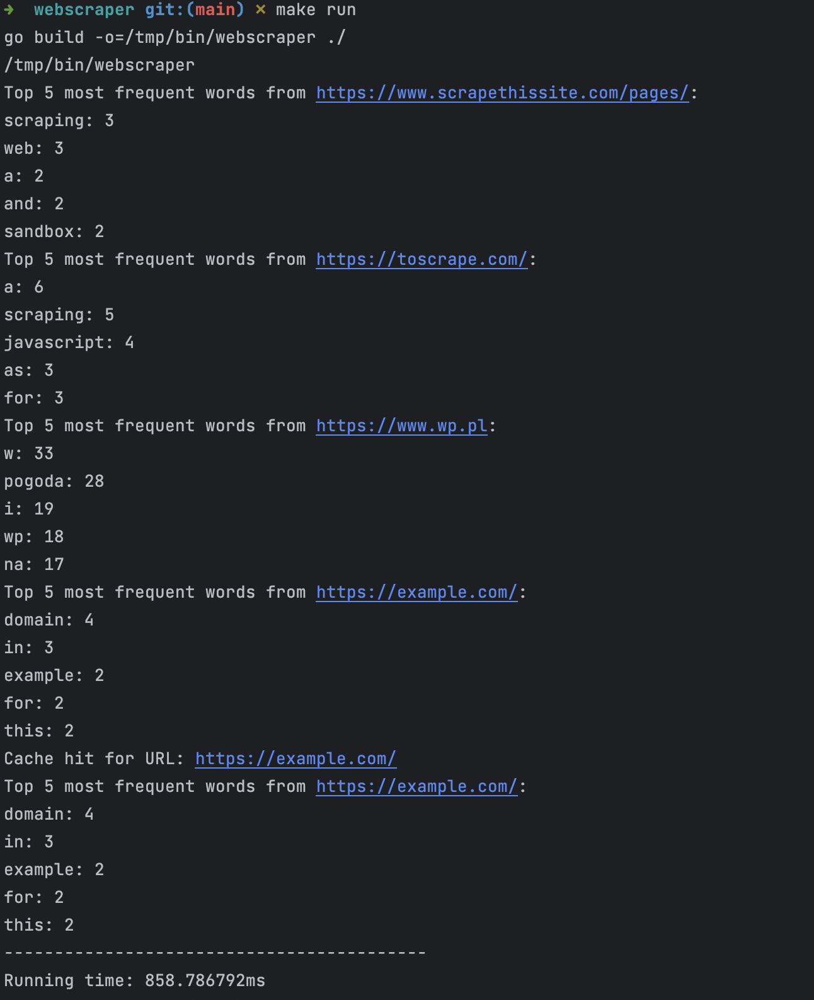
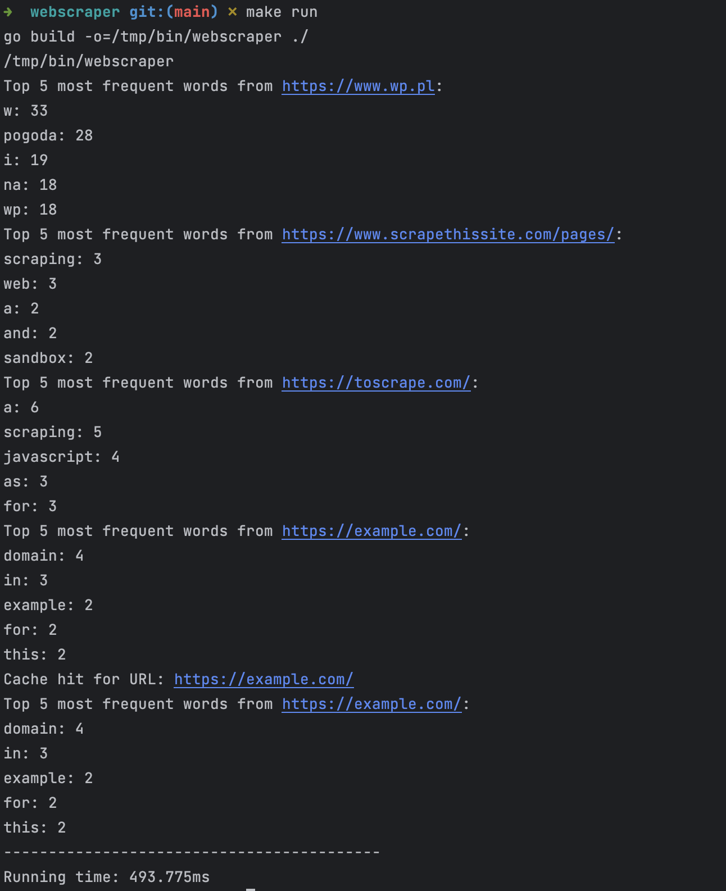

# Recruitment project - Webscraper

## Table of Contents
- [Introduction](#introduction)
- [Features](#features)
- [Prerequisites](#prerequisites)
- [Getting Started](#getting-started)
    - [Usage](#usage)
    - [Test](#test)
- [Outputs](#outputs)
- [References](#references)


## Introduction

This tool is a website word frequency analyzer built using Go (Golang). It leverages goroutines, channels, and the standard Go library to combine text from multiple websites and generate a list of the most frequently appearing words. I followed tasks listed in [Projects](https://github.com/users/raj3k/projects/5) while building this tool. Two methods were used to scrape website contents:
- https://github.com/raj3k/webscraper/blob/main/internal/parse/parse.go - method from soup package
- https://github.com/raj3k/webscraper/blob/main/internal/tokenizer/tokenizer.go - used html/tokenizer accordaning to requirements

## Features

- [Fetch text content from multiple websites.](https://github.com/raj3k/webscraper/blob/main/main.go#L28C10-L28C10)
- [Generate word frequency statistics.](https://github.com/raj3k/webscraper/blob/main/main.go#L39)
- [Concurrent using goroutines and channels.](https://github.com/raj3k/webscraper/blob/main/webscraper.go#L52)
- [Basic cache mechanism.](https://github.com/raj3k/webscraper/blob/main/webscraper.go#L123)
- [Limit the number of concurrently running goroutines.](https://github.com/raj3k/webscraper/blob/main/webscraper.go#L105)
- [Running application in Docker container](https://github.com/raj3k/webscraper/blob/main/Dockerfile)

## Prerequisites

Before you begin, ensure you have the following installed on your system:

- [Go 1.21 (Golang)](https://golang.org/doc/install)
- Optional: [Docker](https://www.docker.com/)
## Getting Started

### Usage

1. Clone this repository & change into the project directory:
   ```shell
   git clone https://github.com/raj3k/webscraper.git
   cd webscraper
   ```
    a. Run project using **Makefile**:
    ```shell
   make run
    ```
    b. Run project using **Docker**:
    ```shell
   docker build -t webscraper .
   docker build -e URLS="https://example.com/,https://toscrape.com/" webscraper
    ```
   or
    ```shell
   docker build -t webscraper .
   docker build webscraper
    ```

### Test
1. Clone this repository & change into the project directory:
   ```shell
   git clone https://github.com/raj3k/webscraper.git
   cd webscraper
   ```
2. Test project using **Makefile**:
    ```shell
   make test
    ```

## Outputs
### Using Makefile and limiting to 2 concurrent goroutines

### Using Makefile and limiting to 4 concurrent goroutines


## References
- https://github.com/anaskhan96/soup/tree/master
- https://github.com/lotusirous/go-concurrency-patterns/blob/main/10-google2.0/main.go
- https://github.com/luk4z7/go-concurrency-guide
- https://medium.com/@deckarep/gos-extended-concurrency-semaphores-part-1-5eeabfa351ce
